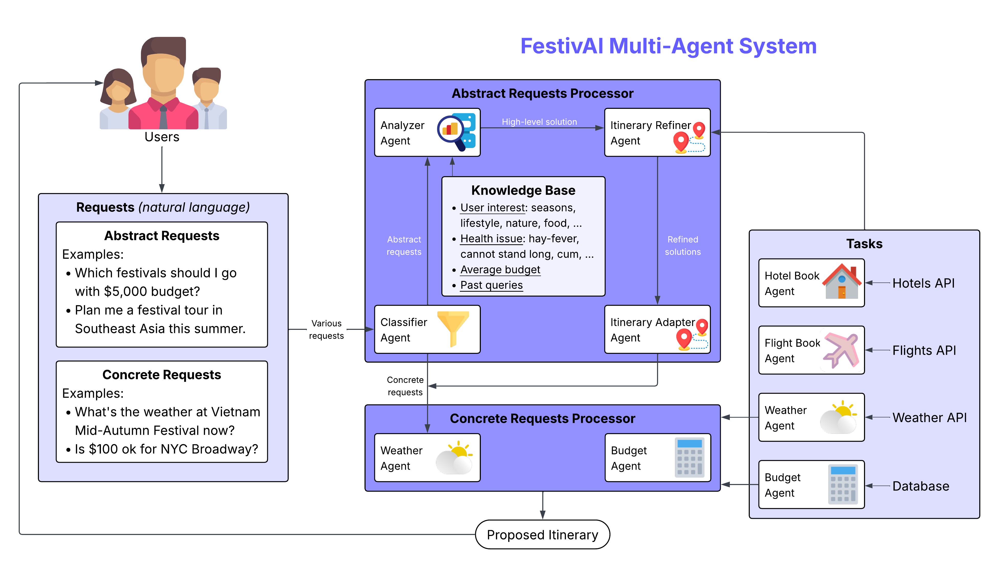

# FestivAI



## Overview

FestivAI is a multi-agent AI application that generates itineraries to global festivals and countries from users' abstract and concrete prompts.

## Demo Video
Watch the complete demo and walkthrough of FestivAI:
[](https://www.youtube.com/watch?v=YOUR_VIDEO_ID)

## Prerequisites

- Google Cloud SDK
- Google Cloud Project (GCP) credits
- Python 3.8+
- Node.js

## Setup Instructions

### 1. Google Cloud Configuration

First, configure your Google Cloud environment:

```bash
# List available projects
gcloud projects list

# Set the project ID
gcloud config set project festivai-466417

# Enable required APIs
gcloud services enable aiplatform.googleapis.com
gcloud services enable run.googleapis.com
gcloud services enable cloudbuild.googleapis.com
gcloud services enable containerregistry.googleapis.com
```

### 2. Authentication

Set up authentication for your local environment:

```bash
# Authenticate with Google Cloud
gcloud auth login

# Set up application default credentials
gcloud auth application-default login
```

### 3. Environment Setup

Create a virtual environment and install dependencies:

```bash
# Create virtual environment
python -m venv venv

# Activate virtual environment
# On Windows:
venv\Scripts\activate
# On macOS/Linux:
source venv/bin/activate

# Install dependencies
pip install -r requirements.txt
```

## Deployment

### Local Development

To run the application locally:

```bash
# Set environment variables
export GOOGLE_CLOUD_PROJECT=festivai-466417

# Run the application
python main.py
```

### Cloud Deployment

Deploy to Google Cloud Run:

```bash
# Build and deploy using Cloud Build
gcloud builds submit --tag gcr.io/festivai-466417/festivai

# Deploy to Cloud Run
gcloud run deploy festivai \
    --image gcr.io/festivai-466417/festivai \
    --platform managed \
    --region us-central1 \
    --allow-unauthenticated
```

## Features

- **AI-Powered Content Generation**: Create personalized festival greetings using advanced AI models
- **Multi-Format Support**: Generate content in various formats (text, images, cards)
- **Scalable Architecture**: Built on Google Cloud for automatic scaling
- **Real-time Processing**: Fast content generation and delivery
- **Customizable Templates**: Support for various festival themes and occasions

## API Endpoints

The application provides RESTful API endpoints for:

- `/generate` - Generate personalized festival content
- `/health` - Health check endpoint
- `/templates` - List available templates
- `/customize` - Customize existing templates

## Configuration

Key configuration parameters:

- `PROJECT_ID`: Google Cloud Project ID
- `REGION`: Deployment region (default: us-central1)
- `MODEL_NAME`: AI model identifier
- `MAX_CONTENT_LENGTH`: Maximum content length for generation

## Environment Variables

Required environment variables:

```env
GOOGLE_CLOUD_PROJECT=festivai-466417
GOOGLE_APPLICATION_CREDENTIALS=/path/to/service-account-key.json
MODEL_ENDPOINT=your-model-endpoint
API_KEY=your-api-key
```

## Monitoring and Logging

The application includes:

- Cloud Monitoring integration for performance metrics
- Cloud Logging for application logs
- Error tracking and alerting
- Custom metrics for content generation statistics

## Technologies

- Python
- React
- TypeScript
- Gemini 2.5 Pro
- Gemma 3
- GCP (Cloud Run)
- NVIDIA L4 GPU
